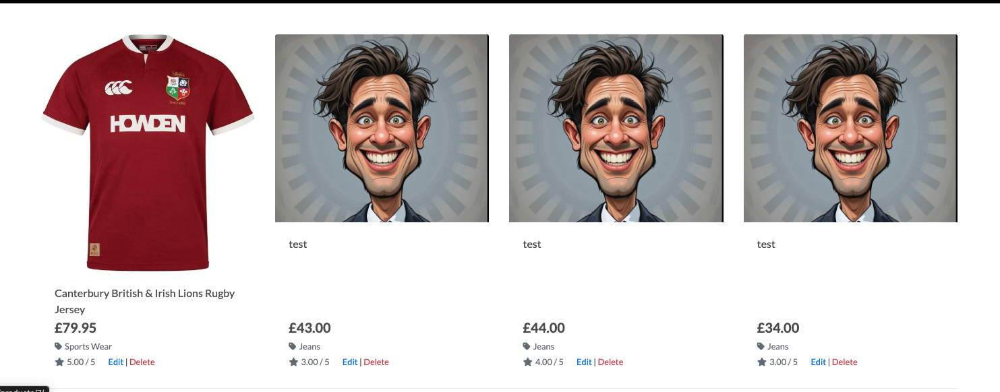

# Nothing Special


Nothing Special is a full-stack e-commerce platform built using Django and Python on the backend, with HTML, CSS, JavaScript, and Bootstrap powering the frontend.
It delivers a smooth shopping experience through clean UI, robust data handling, and secure payment integration with Stripe.

[Visit NothingSpecial Here](https://nothingspecial-project4-7ae6e31facd5.herokuapp.com/)

---

## User Experience

### Strategy Plane

#### **Project Overview**

Nothing Special is a Business-to-Consumer (B2C) web application created to provide a seamless online shopping experience for men’s fashion.
Whether users are browsing staple wardrobe essentials, trend-focused pieces, or full seasonal collections, the platform offers a curated and easy-to-navigate shopping environment.

**Target Audience**

The platform is designed for fashion-conscious men of all ages who value:
- Convenience
- Style
- Quality
- A clean, frustration-free shopping experience

This includes:
- Busy professionals needing reliable officewear
- Students looking for streetwear and affordable basics
- Casual shoppers browsing everyday essentials
- Style-focused users comparing products and reviews

**Why This Project?**

E-commerce continues to grow rapidly, especially in menswear, where online shopping offers:

- A wider selection than physical retail
- Easier comparison of products
- A more personalised shopping journey
- Convenience for users with busy lifestyles

As someone passionate about both fashion and technology, this project allowed me to combine clean UX design with robust backend functionality, creating a platform where shopping feels simple, intuitive, and visually engaging.

**Core Objectives**

Nothing Special aims to:
- Provide a streamlined browsing and shopping experience
- Allow users to securely register, log in, and manage their account
- Offer product search, filtering, and sorting features
- Support full checkout functionality with Stripe payments
- Give users persistent features such as order history, wishlist, and recently viewed items
- Maintain strong accessibility and responsive design across all devices

The final goal is to create a polished, user-centred e-commerce application that is functional, scalable, and visually appealing—reflecting real-world industry standards.

## Scope Plane

### Feature Planning

Below is a feature planning table outlining the key opportunities for Nothing Special, an e-commerce platform for men’s fashion. Each feature has been rated for Importance and Viability on a scale from 1 to 5. Features with high scores in both are essential to the Minimum Viable Product (MVP). Medium-rated features are should-have items that may follow after launch, while lower-rated features are could-have options for future updates.

The application includes different user roles:

- **Guest**: Unauthenticated users who can browse the site and add products to the cart.
- **User**: User: Registered users who can place orders, view order history, and manage their account.
- **Admin**: Superusers with access to the Django admin panel to manage products, orders, and users.

| User Type | Feature | Importance | Viability | MVP Status |
|-----------|---------|------------|-----------|------------|
| Guest | Browse product catalog | 5 | 5 | ✅ |
| Guest | View product details | 5 | 5 | ✅ |
| Guest | Search and filter products | 5 | 4 | ✅ |
| Guest | Add products to cart | 5 | 5 | ✅ |
| Guest | Sign up for an account | 4 | 5 | ✅ |
| User | Log in/out | 5 | 5 | ✅ |
| User | Complete checkout with payment | 5 | 4 | ✅ |
| User | View and manage order history | 4 | 4 | ✅ |
| User | Update profile and shipping info | 4 | 4 | ✅ |
| User | Reset password | 5 | 5 | ✅ |
| User | Recently viewed products | 5 | 5 | ✅ |
| User | Wishlist or save items | 5 | 5 | ✅ |
| User | Receive order confirmation and status emails | 4 | 4 | ✅ |
| Admin | Access Django admin panel | 5 | 5 | ✅ |
| Admin | Add, edit, and delete products | 5 | 5 | ✅ |
| Admin | Manage customer orders | 5 | 5 | ✅ |
| Admin | View and manage user accounts | 4 | 4 | ✅ |
| All | Responsive design for mobile/tablet | 5 | 5 | ✅ |
| All | View featured collections or sale items | 3 | 4 | ❌ |
| All | Leave product reviews | 3 | 3 | ❌ |
| All | Share products via social media | 2 | 3 | ❌ |

## Structure Plane

### User Stories

| User Story ID | As a/an | I want to be able to... | So that I can... |
|---------------|---------|--------------------------|------------------|
| 1 | Guest | Browse a list of all products | Explore what’s available without signing up |
| 2 | Guest | View full details of a product | Decide if it’s right for me before buying |
| 3 | Guest | Search for and filter products by keyword, category, or price | Find items that suit my needs |
| 4 | Guest | Add products to my cart | Begin the shopping process |
| 5 | Guest | Sign up for an account | Track orders and access exclusive features |
| 6 | User | Log in and log out | Securely access my account and orders |
| 7 | User | Complete a purchase | Buy the products I want |
| 8 | User | View my past orders | Keep track of what I’ve bought |
| 9 | User | Update my shipping and personal info | Ensure accurate deliveries |
| 10 | User | Reset my password | Recover access if I forget my login |
| 11 | User | Receive order confirmation and status emails | Stay updated on my purchases |
| 12 | Admin | Access the Django admin panel | Manage backend operations and data |
| 13 | Admin | Add, edit, or remove products | Keep the store's inventory up to date |
| 14 | Admin | Manage customer orders | Fulfill purchases efficiently |
| 15 | Admin | View and manage user data | Provide support and resolve issues |
| 16 | All | View the site on mobile/tablet devices | Shop comfortably on any screen |
| 17 | All | See featured or sale collections *(Future Feature)* | Discover special offers and new arrivals |
| 18 | All | Leave product reviews *(Future Feature)* | Share feedback with other customers |
| 19 | All | Create a wishlist *(Future Feature)* | Save items for later purchase |
| 20 | All | Share products via social media *(Future Feature)* | Let friends know about great finds |

--- 

### Skeleton Plane

#### **Wireframes**

Wireframes for the project were created using [Balsamiq](https://balsamiq.com/)


### Surface Plane

#### **Colour Scheme**

The visual identity of Nothing Special is built around a clean black and white colour palette, chosen to create a sleek, modern, and minimalist user experience.

* Black – Used primarily for headers, text, and key interface elements, black provides strong contrast and a professional, bold look. It helps emphasize important content and navigational features.

* White – Serving as the main background colour, white ensures a bright and spacious feel throughout the site. It contributes to a clean, uncluttered design that highlights product images and details effectively.

This monochrome combination creates a timeless and elegant aesthetic that complements the focus on men’s clothing — simple, stylish, and easy to navigate without distractions.

#### **Typography**

For Nothing Special, I chose to use a single font — Lato, sourced from Google Fonts. To preview and experiment with the font’s appearance across different elements, I used tools like Font Joy to ensure Lato complemented the overall design and tone of the site.

Lato is a clean, modern, and highly readable sans-serif typeface. Its open letterforms and balanced spacing make it ideal for an ecommerce platform focused on men’s clothing, where clarity and simplicity are essential. By using one consistent font throughout, the interface maintains a cohesive and polished look, enhancing accessibility and ease of navigation for all users.

#### **Imagery**

This project does not include any preloaded or static imagery. Instead, product images displayed on the site are sourced from ASOS, which offers a wide variety of men’s clothing items suitable for showcasing on the platform.

Using ASOS images allows the site to present a diverse and up-to-date product catalog without needing to host a large library of static images. All images are stored remotely on AWS S3 to ensure efficient delivery and scalability.

This approach keeps the project lightweight while providing visually rich content that reflects current fashion trends and styles.

---

# Database Schema & Data Validation

This project uses a relational database architecture to support a scalable, reliable ecommerce platform.  
PostgreSQL is used for production, while SQLite is used during development.  
All queries and relationships are managed through Django’s ORM, ensuring strong data integrity and a clean relational design.

---

## Database Design & Normalisation

The schema follows relational database best practices and is normalised to reduce redundancy and improve maintainability.

### **1. User Profile Separation**
Instead of altering Django’s built-in `User` model, the project uses a separate `UserProfile` linked via a **One-to-One** relationship.  
This keeps authentication clean and stores additional fields such as:

- Default shipping address  
- Phone number  
- Postcode  
- Country  
- Order history (reverse relation)

### **2. Media Management with AWS S3**
Product images are stored on AWS S3, while only the image URL or file path is stored in the database.  
This improves:

- Storage efficiency  
- Performance  
- Scalability  

### **3. Orders & Line Items**
Orders use an **OrderLineItem** model to represent each product in the order.  
This ensures:

- A single order can contain multiple products  
- Accurate tracking of per-item quantities and prices  
- Clean separation of order metadata and product details  

### **4. Product Categories**
Products are assigned to a category through a **ForeignKey**, allowing them to be browsed by category without duplicating category data.

### **5. Wishlist Structure**
Wishlists are implemented via:

- A **One-to-One** relationship between User and Wishlist  
- A **ForeignKey** relationship between WishlistItem and Product  

This allows users to store items without duplicating product data.


### **6. Recently Viewed Products**
The RecentlyViewed model stores a list of products each user has recently interacted with.
It uses a simple structure:
- User → Product via ForeignKeys
- Timestamp to record when the item was last viewed
- A unique constraint to prevent duplicate entries

This allows the site to display a personalised list of recently viewed items and improves the browsing experience by helping users quickly return to products they were interested in.

---

# Entity Relationship Overview

### **User**
- Django’s built-in user model  
- Connected to:
  - `UserProfile` (1:1)  
  - `Order` (1:M)  
  - `Review` (1:M)  
  - `Wishlist` (1:1)

### **UserProfile**
- Stores additional user information  
- Auto-created using Django signals  
- Tied to order history  

### **Product**
- Contains key product info: name, SKU, description, price, rating, image, etc.  
- Connected to:
  - `Category` (M:1)  
  - `Review` (1:M)  
  - `OrderLineItem` (M:1)  
  - `WishlistItem` (M:1)  

### **Category**
- Used for product filtering and navigation  
- Linked via ForeignKey to products  

### **Order**
- Stores order and delivery information  
- Linked to `UserProfile`  
- Automatically calculates totals and delivery fees  

### **OrderLineItem**
- Connects an order to individual product entries  
- Stores quantity and total cost per item  

### **Review**
- Linked to `Product` and `User`  
- Stores rating, comment, timestamp  
- Validates rating range (1-5)  

### **Wishlist & WishlistItem**
- Wishlist belongs to a user  
- WishlistItem connects Product → Wishlist  

### **Recently Viewed**
Tracks products a user has recently interacted with
Connected to:
- User (M:1)
- Product (M:1)

Each time a logged-in user views a product, a timestamped entry is recorded.
The model enforces one record per user–product pair, updating the timestamp rather than creating duplicates.


---

# Data Validation Improvements

Validation is implemented at **both model level and form level**, ensuring data stays clean, accurate, and safe throughout the application.

---

## Model-Level Validation

### **Product**
- **Price validation:**  
  `MinValueValidator(0)` prevents negative prices  
- **Rating validation:**  
  1–5 rating enforced through `MinValueValidator` and `MaxValueValidator`
- Optional fields (image, image_url) support flexible content management  

### **Review**
- Rating strictly validated as an integer between **1 and 5**  
- Automatically timestamped  
- Ordered by newest first  

### **Order**
- Delivery cost, order total, and grand total are **never user-controlled**  
- Totals are calculated internally for full integrity  
- Country selection validates against a controlled list  

### **UserProfile**
- Uses consistent validation rules with the checkout form  
- Ensures saved user info is clean and complete  

---

## Form-Level Validation

### **Checkout Form**
- Required fields display an asterisk  
- Autofocus improves usability  
- Ensures:
  - Valid email formats  
  - Non-empty required fields  
  - Proper phone number and postcode inputs  

### **User Profile Form**
- Matches styling and validation from checkout  
- Prevents users from saving incomplete or malformed profile data  

### Combined Validation Workflow

The project uses **layered validation**, meaning data is validated at:

1. **Frontend/UI level** (placeholders, required fields, autofocus)  
2. **Form level** (cleaned_data, input formatting)  
3. **Model level** (validators, field constraints)  

This ensures:

- Clean and consistent database records  
- Friendly error messages for users  
- Protection against tampered or invalid requests  
- Reliable order handling and accurate totals  

### Benefits of These Validation Improvements

- Prevents invalid product and review data  
- Ensures secure and correct checkout inputs  
- Keeps user profiles accurate and complete  
- Enhances reliability and consistency across all models  
- Improves the overall user experience  
- Reduces long-term maintenance effort  

---

## Features

### General Features of the site

**Navigation Bar**


**List of Products**


**Product Detail Page**


**Add Product to Bag**


**Shopping Bag**


**Order Confirmation**


**Add Products**


**Profile**


**Log In**


**Register**


**Wishlist**


**Recently Viewed**


### Future Implementations

As Nothing Special evolves, there are several exciting features planned to enhance the user experience, increase engagement, and broaden the platform’s functionality:

* Social Media Integration: Enable users to share their favourite products and purchases on platforms like Instagram, Facebook, and Twitter, boosting brand exposure and customer interaction.

* Social Login Options: Implement social authentication methods (e.g., Google, Facebook, Apple) to simplify user sign-up and login processes, reducing friction and increasing conversions.

* Advanced Product Filtering: Add more detailed filters such as size, colour, price range, brand, and style to help users find products that match their preferences quickly and easily.

* Wishlist and Favorites: Allow users to save products to wishlists or favourites for later viewing, improving user retention and purchase intent.

* Product Reviews and Ratings: Expand the review system to include verified purchase badges, image uploads with reviews, and sorting options by rating or date to enhance trust and decision-making.

* Order Tracking and Notifications: Integrate real-time order tracking and automated notifications for order confirmation, shipping updates, and delivery status to improve transparency and customer satisfaction.

* Personalised Recommendations: Develop machine learning-driven product recommendations based on user behaviour, purchase history, and browsing patterns to increase sales and user engagement.

* Multi-Currency and Internationalization: Support multiple currencies and languages to expand the platform’s reach to international customers.

* Admin Analytics Dashboard: Build out an admin dashboard with comprehensive sales reports, customer analytics, inventory management, and content moderation tools for efficient store management.

These future features will help transform Nothing Special into a fully featured, user-friendly ecommerce platform that caters to the needs of men’s fashion shoppers.

### Accessibility

I have prioritised making Nothing Special accessible to all users, including those with disabilities, to ensure a smooth and inclusive shopping experience. The following measures have been implemented to improve accessibility:

* Semantic HTML: The site uses semantic HTML elements to clearly define the structure and content, allowing screen readers and assistive technologies to interpret pages accurately and improve navigation.

* Clear and Accessible Icons: All icons include descriptive text labels or ARIA attributes where needed, ensuring users relying on screen readers or those who prefer text cues can understand their function.

* Color Contrast: The colour scheme has been carefully selected and tested to meet WCAG guidelines for sufficient contrast, supporting users with visual impairments such as colour blindness or low vision.

* Responsive Design: The layout adapts seamlessly across a range of devices and screen sizes, providing an accessible and consistent experience on desktops, tablets, and mobile phones.

These steps help ensure Nothing Special is welcoming and usable for all customers, regardless of their abilities or technology preferences.

#### Accessibility Testing
To further ensure the app’s accessibility, I have tested it using the following tools:

* Lighthouse: Conducted automated accessibility audits using Google’s Lighthouse tool to identify and address any potential accessibility issues.

* WAVE: Used the WAVE tool to further evaluate the app’s compliance with accessibility standards.

For more details on the testing process and results, please refer to the [TESTING.md](/TESTING.md).

## Technologies Used

### Languages Used

HTML, CSS, JavaScript, Python

### Frameworks Used

[Django](https://www.djangoproject.com/) - Version 5.2 - a powerful and flexible Python web framework that promotes efficient development and clean, maintainable code, allowing developers to build robust web applications quickly.

[Bootstrap](https://getbootstrap.com/docs/4.6/getting-started/introduction/) – Version 4 – a widely used front-end CSS framework that supports responsive, mobile-first design. It offers a comprehensive set of pre-built components and a flexible grid system, streamlining the development of consistent and visually appealing layouts.


## Libraries & Packages Used

This project relies on several Python libraries and packages to enhance functionality, improve performance, and ensure ease of development. Below are the key libraries and their official websites:

- **[asgiref](https://pypi.org/project/asgiref/)**: ASGI (Asynchronous Server Gateway Interface) reference implementation for Python, supporting Django’s async capabilities.
- **[boto3](https://boto3.amazonaws.com/v1/documentation/api/latest/index.html)**: AWS SDK for Python, used to manage AWS S3 for media storage.
- **[botocore](https://botocore.amazonaws.com/v1/documentation/api/latest/index.html)**: Low-level interface required by Boto3 for interacting with AWS services.
- **[certifi](https://pypi.org/project/certifi/)**: Provides Mozilla’s root certificates for validating secure SSL connections.
- **[cffi](https://pypi.org/project/cffi/)**: Allows integration with C code, required by cryptographic libraries.
- **[charset-normalizer](https://pypi.org/project/charset-normalizer/)**: Detects and normalizes character encodings; used by HTTP libraries like `requests`.
- **[cryptography](https://pypi.org/project/cryptography/)**: Secure cryptographic recipes and primitives for Python.
- **[defusedxml](https://pypi.org/project/defusedxml/)**: Protects against common XML vulnerabilities by safely parsing untrusted XML input.
- **[dj-database-url](https://pypi.org/project/dj-database-url/)**: Parses database URLs from environment variables, useful in cloud deployment.
- **[Django](https://www.djangoproject.com/)**: High-level Python web framework used to build the core backend of the project.
- **[django-allauth](https://django-allauth.readthedocs.io/en/latest/)**: Integrated Django authentication app for registration, login, email verification, and social accounts.
- **[django-countries](https://pypi.org/project/django-countries/)**: Provides a country field for models, used in shipping forms.
- **[django-crispy-forms](https://django-crispy-forms.readthedocs.io/en/latest/)**: Improves Django form rendering with flexible layouts and Bootstrap support.
- **[django-storages](https://django-storages.readthedocs.io/en/latest/)**: Custom storage backends for Django, used here to integrate AWS S3 for static/media files.
- **[flake8](https://flake8.pycqa.org/en/latest/)**: Tool for linting Python code and enforcing style guidelines.
- **[gunicorn](https://gunicorn.org/)**: WSGI HTTP server for running Django applications in production.
- **[idna](https://pypi.org/project/idna/)**: Supports Internationalized Domain Names (IDNs) in URLs.
- **[jmespath](https://jmespath.org/)**: JSON query language used by Boto3 to filter and transform AWS responses.
- **[mccabe](https://pypi.org/project/mccabe/)**: Code complexity checker, used by Flake8.
- **[oauthlib](https://pypi.org/project/oauthlib/)**: OAuth 1 and 2 client library used for social authentication.
- **[packaging](https://pypi.org/project/packaging/)**: Utilities for handling Python package versions and metadata.
- **[pillow](https://python-pillow.org/)**: Python Imaging Library fork used for image processing and validation.
- **[psycopg2](https://www.psycopg.org/)**: PostgreSQL adapter for Python, used for database connections in production.
- **[pycodestyle](https://pypi.org/project/pycodestyle/)**: Checks Python code against PEP 8 styling conventions.
- **[pycparser](https://pypi.org/project/pycparser/)**: Parses C code used by libraries like `cffi`.
- **[pyflakes](https://pypi.org/project/pyflakes/)**: Detects Python syntax errors and potential bugs.
- **[PyJWT](https://pypi.org/project/PyJWT/)**: JSON Web Token implementation for Python.
- **[python-dateutil](https://pypi.org/project/python-dateutil/)**: Extended datetime support for parsing and formatting dates.
- **[python3-openid](https://pypi.org/project/python3-openid/)**: Implements OpenID for Python 3, used with social auth systems.
- **[requests](https://requests.readthedocs.io/en/latest/)**: User-friendly HTTP library for Python, used for API communication.
- **[requests-oauthlib](https://pypi.org/project/requests-oauthlib/)**: Adds OAuth support to the `requests` library.
- **[s3transfer](https://pypi.org/project/s3transfer/)**: Helper for managing AWS S3 upload/download tasks.
- **[setuptools](https://pypi.org/project/setuptools/)**: Tools for building and distributing Python packages.
- **[six](https://pypi.org/project/six/)**: Compatibility library for writing code compatible with both Python 2 and 3.
- **[sqlparse](https://pypi.org/project/sqlparse/)**: SQL parser used internally by Django’s ORM.
- **[stripe](https://pypi.org/project/stripe/)**: Stripe API wrapper for processing online payments.
- **[typing_extensions](https://pypi.org/project/typing-extensions/)**: Backport of Python’s type hinting improvements.
- **[urllib3](https://pypi.org/project/urllib3/)**: Advanced HTTP client library with connection pooling and retry features.

### Programs Used

In the development of this project, several tools and programs were employed to enhance the workflow, design, and deployment process. Below is a list of the primary programs used, along with their official websites:

- **[Am I Responsive](https://ami.responsivedesign.is/)**: A tool used to preview how the website looks on various screen sizes and devices, ensuring responsiveness.  
- **[AWS S3](https://aws.amazon.com/s3/)**: A cloud-based service used for storing, managing, and delivering images and videos. Integrated with Django for image handling.  
- **[Balsamiq](https://balsamiq.com/)**: A wireframing tool used to design low-fidelity mockups and layouts for the user interface.  
- **[Coolors](https://coolors.co/)**: A color scheme generator used to create and refine the color palette for the project.  
- **[DrawSQL](https://drawsql.app/)**: A visual database design tool used to create and manage the database schema and generate visual representations of the database relationships.  
- **[Favicon](https://favicon.io/)**: A tool used to generate a favicon for the website, providing the small icon seen in the browser tab.  
- **[Git](https://git-scm.com/)**: A version control system used for tracking changes in the project codebase, collaborating with other developers, and managing different project versions.  
- **[Google Dev Tools](https://developers.google.com/web/tools/chrome-devtools)**: A set of developer tools built into Google Chrome, used for debugging, performance testing, and ensuring responsive design across devices.  
- **[Lighthouse](https://developers.google.com/web/tools/lighthouse)**: A tool for auditing the performance, accessibility, and SEO of the website, used to ensure the application meets web standards.  
- **[Pip](https://pypi.org/project/pip/)**: A package management system for Python used to install and manage project dependencies from the `requirements.txt` file.  
- **[PostgreSQL](https://www.postgresql.org/)**: The relational database management system used in the production environment for storing user and recipe data.  
- **[SQLite](https://www.sqlite.org/)**: A lightweight, serverless database used during development for testing purposes.  
- **[WAVE](https://wave.webaim.org/)**: A web accessibility evaluation tool used to test and improve the accessibility of the website for users with disabilities.  

### Deployment

The project is deployed using Heroku. To deploy the project:

#### **Heroku app setup**

  1. From the [Heroku dashboard](https://dashboard.heroku.com/), click the new button in the top right corner and select create new app.
  2. Give your app a name (this must be unique), select the region that is closest to you and then click the create app button bottom left.

#### **Preparation for deployment in VSCode**

1. Install dj_database_url and psycopg2 (they are both needed for connecting to the external database you've just set up):

   ```bash
   pip3 install dj_database_url==0.5.0 psycopg2
   ```

2. Update your requirements.txt file with the packages just installed:

    ```bash
    pip3 freeze > requirements.txt
    ```

3. In settings.py underneath import os, add `import dj_database_url`

4. Find the section for DATABASES and comment out the code. Add the following code below the commented out database block, and use the URL copied from elephantSQL for the value:

    (NOTE! don't delete the original section, as this is a temporary step whilst we connect the external database. Make sure you don't push this value to GitHub - this value should not be saved to GitHub, it will be added to the Heroku config vars in a later step, this is temporary to allow us to migrate our models to the external database)

    ```python
    DATABASES = {
        'default': dj_database_url.parse('paste-elephantsql-db-url-here')
    }
    ```

5. In the terminal, run the show migrations command to confirm connection to the external database:

    ```bash
    python3 manage.py runserver
    ```

6. If you have connected the database correctly you will see a list of migrations that are unchecked. You can now run migrations to migrate the models to the new database:

    ```bash
    python3 manage.py migrate
    ```

7. Create a superuser for the new database. Input a username, email and password when directed.

    ```bash
    python3 manage.py createsuperuser
    ```

8. Install gunicorn which will act as our webserver and freeze this to the requirements.txt file:

    ```bash
    pip3 install gunicorn
    pip3 freeze > requirements.txt
    ```

9. Create a `Procfile` in the root directory. This tells Heroku to create a web dyno which runs gunicorn and serves our django app. Add the following to the file (making sure not to leave any blank lines underneath):

    ```Procfile
    web: gunicorn seaside_sewing.wsgi:application
    ```

10. Log into the Heroku CLI in the terminal and then run the following command to disable collectstatic. This command tells Heroku not to collect static files when we deploy:

    ```bash
    heroku config:set DISABLE_COLLECTSTATIC=1 --app heroku-app-name-here
    ```

11. We will also need to add the Heroku app and localhost (which will allow GitPod to still work) to ALLOWED_HOSTS = [] in settings.py:

    ```python
    ALLOWED_HOSTS = ['{heroku deployed site URL here}', 'localhost' ]
    ```

12. Save, add, commit and push the changes to GitHub. You can then also initialize the Heroku git remote in the terminal and push to Heroku with:

    ```bash
    heroku git:remote -a {app name here}
    git push heroku master
    ```

13. You should now be able to see the deployed site (without any static files as we haven't set these up yet).

14. To enable automatic deploys on Heroku, go to the deploy tab and click the connect to GitHub button in the deployment method section. Search for the projects repository and then click connect. Click enable automatic deploys at the bottom of the page.

#### **Generate a SECRET KEY & Updating Debug**

1. Django automatically sets a secret key when you create your project, however we shouldn't use this default key in our deployed version, as it leaves our site vulnerable. We can use a random key generator to create a new SECRET_KEY which we can then add to our Heroku config vars which will then keep the key protected.
2. [Django Secret Key Generator](https://miniwebtool.com/django-secret-key-generator/) is an example of a site we could use to create our secret key. Create a new key and copy the value.
3. In Heroku settings create a new config var with a key of `SECRET_KEY`. The value will be the secret key we just created. Click add.
4. In settings.py we can now update the `SECRET_KEY` variable, asking it to get the secret key from the environment, or use an empty string in development:

    ```python
    SECRET_KEY = os.environ.get('SECRET_KEY', ' ')
    ```

5. We can now adjust the `DEBUG` variable to only set DEBUG as true if in development:

    ```python
    DEBUG = 'DEVELOPMENT' in os.environ
    ```

6. Save, add, commit and push these changes.

### Local Development

#### **How to Fork**

To fork the repository:

1. Log in (or sign up) to GitHub.

2. Go to the repository for this project, [Nothing Special](https://github.com/maarkwilliams/Project4).

3. Click on the fork button in the top right of the page.

#### **How to Clone**

To clone the repository:

1. Log in (or sign up) to GitHub.

2. Go to the repository for this project, [Nothing Special](https://github.com/maarkwilliams/Project4).

3. Click the Code button, select whether you would like to clone with HTTPS, SSH or the GitHub CLI and copy the link given.

4. Open the terminal in your chosen IDE and change the current working directory to the location you would like to use for the cloned repository.

5. Type the following command into the terminal `git clone` followed by the link you copied in step 3.

6. Set up a virtual environment (this step is not required if you are using the Code Institute template and have opened the repository in VSCode as this will have been set up for you).

7. Install the packages from the requirements.txt file by running the following command in the terminal:

```bash
pip3 install -r requirements.txt
```

---

## Testing

Please refer to the [TESTING.md](/TESTING.md)

---

## Credits

### Code Used

This project was created using methods taught in the Code Institutes walkthrough projects.

### Content & Media

All product descriptions, titles, and imagery featured on the site were sourced from [ASOS](https://www.asos.com/men/) and are used strictly for educational and demonstration purposes as part of this portfolio project.

This project is not affiliated with or endorsed by ASOS. All content was used to simulate a realistic e-commerce environment for learning and presentation only.

### Acknowledgments

I would like to acknowledge the following people who have helped me with completing this project:

* My brother for his patience and support whilst working on my final project.
* My Code Institute mentor, Jubril.
* My Code Institute tutor, Marko.
* My friend Josh who helped me troubleshoot when I was stuck on difficult bugs.