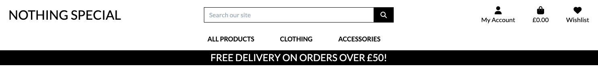

# Nothing Special - Testing

[Visit Nothing Special Here](https://nothingspecial-project4-7ae6e31facd5.herokuapp.com/)

---

Testing was an ongoing process throughout the development of this project. From the early stages of building functionality to the final design refinements, a range of tools and techniques were used to ensure the application performs as expected.

Google Chrome Developer Tools were used extensively to test layout responsiveness, debug issues, and inspect elements across different screen sizes. Manual testing was also carried out on various devices to ensure the site functions smoothly on desktop, tablet, and mobile.

Automated tools such as Lighthouse and WAVE were used to assess accessibility, performance, and best practices, helping to improve the overall user experience.

---
## Validation Testing

### HTML Validation

HTML was validated using the [W3C Markup Validation Service](https://validator.w3.org/). 

Since the project is built with Django, the remaining errors and warnings are related to the framework's template syntax and not the final rendered HTML.css

| Page | Result | Evidence |
| :--- | :--- | :---: |
| Index Html | Pass| [Index Html Validation](documentation/validation/html/index-html.png) |
| Base Html | Pass | [Base Html Validation](documentation/validation/html/base-html.png) |
| Add Product Html | Pass | [Add Product Validation](documentation/validation/html/addproduct-html.png) |
| Bag Html | Pass | [Bag Html Validation](documentation/validation/html/bag-html.png) |
| Checkout Html | Pass | [Checkout Bag Html  Validation](documentation/validation/html/checkout-html.png)|
| Checkout Success Html| Pass | [Checkout Success Html Validation](documentation/validation/html/checkoutsucess-html.png) |
| Edit Product Html | Pass| [Edit Product Html Validation](documentation/validation/html/editproduct-html.png) |
| Main Nav Html | Pass | [Main Nav Html Validation](documentation/validation/html/mainnav-html.png) |
| Mobile Header Html | Pass | [Mobile Header Html Validation](documentation/validation/html/mobileheader-html.png) |
| Product Html | Pass | [Product Html Validation](documentation/validation/html/product-html.png) |
| Product Detail Html | Pass | [Product Detail Html Validation](documentation/validation/html/productdetail-html.png)|
| Profile | Pass | [Profile Html Validation](documentation/validation/html/profile-html.png) |
| Wishlist Html | Pass | [Wishlist Html Validation](documentation/validation/html/wishlist-html.png) |

### CSS

[W3C](https://validator.w3.org/) was used to validate the CSS.

| File | Result | Evidence |
| :--- | :--- | :---: |
| base.css | Pass | [base.css validation](documentation//validation/css/base-css.png) |
| checkout.css | Pass | [checkout.css validation](documentation//validation/css/checkout-css.png) |
| profile.css | Pass | [profile.css validation](documentation//validation/css/profile-css.png) |

### JavaScript

[JS Hint](https://jshint.com/) was used to validate the JavaScript.

| File | Result | Evidence |
| :--- | :--- | :---: |
| add/edit product js | Pass | [add/edit product js](documentation/validation/js/addeditproduct-js.png) |
| bag js | Pass | [bag js](documentation/validation/js/bag-js.png) |
| country field fs | Pass | [country field js](documentation/validation/js/countryfield-js.png) |
| product js | Pass | [product js](documentation/validation/js/product-js.png) |
| stripe element js| Pass | [stripe elements js](documentation/validation/js/stripeelements-js.png) |

### Python

[Code Institute Python Linter](https://pep8ci.herokuapp.com/) was used to validate the python.

| File | Result | Evidence |
| :--- | :--- | :---: |
| **Bag** |
| bag/context.py | Pass | [validation](documentation/validation/python/bag-context.png) |
| bag/urls.py | Pass | [validation](documentation/validation/python/bag-url.png) |
| bag/views.py | Pass | [validation](documentation/validation/python/bag-views.png) |
| **Checkout** |
| checkout/forms.py | Pass | [validation](documentation/validation/python/checkout-form.png) |
| checkout/models.py | Pass | [validation](documentation/validation/python/checkout-model.png) |
| checkout/signls.py | Pass | [validation](documentation/validation/python/checkout-signal.png) |
| checkout/urls.py | Pass | [validation](documentation/validation/python/checkout-url.png) |
| checkout/views.py | Pass | [validation](documentation/validation/python/checkout-views.png) |
| checkout/webhooks.py | Pass | [validation](documentation/validation/python/checkout-webh.png) |
| checkout/webhooks_handler.py | Pass | [validation](documentation/validation/python/checkout-wh.png) |
| **Product** |
| products/forms.py | Pass | [validation](documentation/validation/python/product-form.png) |
| products/models.py | Pass | [validation](documentation/validation/python/product-model.png) |
| products/urls.py | Pass | [validation](documentation/validation/python/product-url.png) |
| products/views.py | Pass | [validation](documentation/validation/python/product-views.png) |
| products/admin.py | Pass | [validation](documentation/validation/python/products-admin.png) |
| **Profile** |
| profiles/forms.py | Pass | [validation](documentation/validation/python/profile-form.png) |
| profiles/models.py | Pass | [validation](documentation/validation/python/profile-model.png) |
| profiles/views.py | Pass | [validation](documentation/validation/python/profile-view.png) |
| **Wishlist** |
| wishlist/signals.py | Pass | [validation](documentation/validation/python/wishlist-signals.png) |
| wishlist/models.py | Pass | [validation](documentation/validation/python/wishlist-models.png) |
| wishlist/views.py | Pass | [validation](documentation/validation/python/wishlist-views.png) |
| wishlist/apps.py | Pass | [validation](documentation/validation/python/wishlist-apps.png) |
| wishlist/tests.py | Pass | [validation](documentation/validation/python/wishlist-test.png) |
| wishlist/urls.py | Pass | [validation](documentation/validation/python/wishlist-url.png) |
| **Recently Viewed** |
| recentlyviewed/apps.py | Pass | [validation](documentation/validation/python/recentlyviewed-apps.png) |
| recentlyviewed/models.py | Pass | [validation](documentation/validation/python/recentlyviewed-models.png) |
| recentlyviewed/admin.py | Pass | [validation](documentation/validation/python/recentlyviewed-admin.png) |

### Lighthouse

I used Google's Lighthouse tool to evaluate the site's performance, accessibility, best practices, and SEO.

#### Desktop Results

| Page | Result |
| :--- | :--- |
| Home Page | [Home Desktop Lighthouse Testing](documentation/lighthouse/homepage-desktop.png) |
| Product Page | [Product Desktop Lighthouse Testing](documentation/lighthouse/products-desktop.png) |
| Product Deail Page | [Product Detail Desktop Lighthouse Testing](documentation/lighthouse/productdetail-desktop.png) |
| Shopping Bag Page | [Shopping Bag Desktop Lighthouse Testing](documentation/lighthouse/bag-desktop.png) |
| Checkout Page | [Checkout Desktop Lighthouse Testing](documentation/lighthouse/checkout-desktop.png) |
| Log In Page | [Login Desktop Lighthouse Testing](documentation/lighthouse/login-desktop.png) |
| Register Page | [Register Desktop Lighthouse Testing](documentation/lighthouse/register-desktop.png) |
| Profile Page | [Profile Desktop Lighthouse Testing](documentation/lighthouse/profile-desktop.png) |
| Wishlist Page | [Wishlist Desktop Lighthouse Testing](documentation/lighthouse/wishlist-desktop.png) |

#### Mobile Results

|Page|Result|
|---|---|
|Home Page|[Home Mobile Lighthouse Testing](documentation/lighthouse/homepage-mobile.png)|
|Product Page|[Product Mobile Lighthouse Testing](documentation/lighthouse/products-mobile.png)|
|Product Detail Page|[Product Detail Mobile Lighthouse Testing](documentation/lighthouse/productdetail-mobile.png)|
|Shopping Bag Page|[Shopping Bag Mobile Lighthouse Testing](documentation/lighthouse/bag-mobile.png)|
|Checkout Page|[Checkout Mobile Lighthouse Testing](documentation/lighthouse/checkout-mobile.png)|
|Log In Page|[Login Mobile Lighthouse Testing](documentation/lighthouse/login-mobile.png)|
|Register Page|[Register Mobile Lighthouse Testing](documentation/lighthouse/register-mobile.png)|
|Profile Page|[Profile Mobile Lighthouse Testing](documentation/lighthouse/profile-mobile.png)|
|Wishlist Page|[Wishlist Mobile Lighthouse Testing](documentation/lighthouse/wishlist-mobile.png)|

## Automated Testing

Automated testing was added to ensure that key features and custom models behave correctly, and to demonstrate test-driven development practices. The tests cover both models and view logic across the Wishlist and Products apps.

Django’s built-in TestCase class was used to create an isolated test database for each test run, ensuring consistent and repeatable results.

### Wishlist App Tests

1. Wishlist View Tests

- The wishlist page loads successfully (status code 200)
- The correct template is used
- Users can add an item to their wishlist
- Items can be successfully removed from the wishlist

2. Wishlist Model Tests

- A WishlistItem correctly links a user’s wishlist to a product
- Model relationships behave as expected

**Why These Tests Matter**

These tests prove that the custom Wishlist feature works reliably, including the relational behaviour between:

- User
- Wishlist
- WishlistItem
- Product

The automated tests demonstrate proper SDLC practice and validate the originality and stability of the feature.

### Products App Tests

1. Product Model Tests

- Validation prevents negative pricing
- The custom average_rating property correctly calculates review averages

2. Review Model Tests

- Ratings outside the 1–5 range raise ValidationError
- Ensures data integrity and prevents invalid review submissions

**Why These Tests Matter**

These tests verify:

- Custom validation logic
- Custom calculated properties
- Protection against invalid data entering the database
- Assessment-required “stricter validation” improvements

--- 

## Manual Testing

### Testing User Stories  

| User Story ID | As a/an | I want to be able to... | So that I can... | How is this achieved? | Evidence |
| :--- | :--- | :--- | :--- | :--- | :---: |
| 1 | Guest | Browse a list of all products | Explore what’s available without signing up | The homepage displays all products using Django views and templates rendering database entries. | [Product List](documentation/testing/user-stories/1userstory.png) |
| 2 | Guest | View full details of a product | Decide if it’s right for me before buying | Each product links to a detailed page showing images, description, price, and stock. | [Product Detail](documentation/testing/user-stories/2userdtory.png) |
| 3 | Guest | Search for and filter products by keyword, category, or price | Find items that suit my needs | Search form and filters query the database to return matching results dynamically. | [Filtered Products](documentation/testing/user-stories/3us.png) |
| 4 | Guest | Add products to my cart | Begin the shopping process | Cart functionality stores items in session or database tied to the user, allowing quantity changes. | [Add to Cart](documentation/testing/user-stories/4us.png) |
| 5 | Guest | Sign up for an account | Track orders and access exclusive features | Registration page built with `django-allauth` for easy user account creation. | [Register Page](documentation/testing/user-stories/5us.png) |
| 6 | User | Log in and log out | Securely access my account and orders | Secure authentication handled by `django-allauth` managing sessions and login/logout flows. | [Login Page](documentation/testing/user-stories/6us.png) |
| 7 | User | Complete a purchase | Buy the products I want | Checkout form integrates Stripe for payments; order data saved in database on success. | [Checkout](documentation/testing/user-stories/7us.png) |
| 8 | User | View my past orders | Keep track of what I’ve bought | Order history page fetches and lists orders linked to logged-in user. | [Order History](documentation/testing/user-stories/8us.png) |
| 9 | User | Update my shipping and personal info | Ensure accurate deliveries | Profile page with editable shipping and contact details stored in user profile model. | [Profile Page](documentation/testing/user-stories/9us.png) |
| 10 | User | Reset my password | Recover access if I forget my login | Password reset handled via `django-allauth` with email confirmation flow. | [Password Reset](documentation/testing/user-stories/10us.png) |
| 11 | User | Receive order confirmation and status emails | Stay updated on my purchases | Email notifications sent via Django’s email backend when orders are placed or updated. | [Order Email](documentation/testing/user-stories/11us.png) |
| 12 | User | Create a wishlist | Save items for later purchase | Custom `Wishlist` and `WishlistItem` models let users add/remove products from their wishlist and view them on the Wishlist page. | [Wishlist](documentation/feautures/wishlist.png) |
| 13 | User | See my recently viewed items | Quickly return to products I looked at earlier | Custom `RecentlyViewed` model tracks product detail views per user and displays the latest items on the profile page. | [Recently Viewed](documentation/feautures/recently-viewed.png) |
| 14 | Admin | Access the Django admin panel | Manage backend operations and data | Django admin enabled for superusers with full access to models and data. | [Admin Panel](documentation/testing/user-stories/12us.png) |
| 15 | Admin | Add, edit, or remove products | Keep the store's inventory up to date | Admin interface supports CRUD operations on products and categories. | [Admin Product Management](documentation/testing/user-stories/13us.png) |
| 16 | Admin | Manage customer orders | Fulfill purchases efficiently | Order management views in admin show order details and allow status updates. | [Admin Order Management](documentation/testing/user-stories/14us.png) |
| 17 | Admin | View and manage user data | Provide support and resolve issues | User data and profiles accessible through admin for support tasks. | [Admin User Management](documentation/testing/user-stories/15us.png) |
| 18 | All | View the site on mobile/tablet devices | Shop comfortably on any screen | Responsive design using Bootstrap 4 adapts layout for all screen sizes. | [Responsive View](documentation/testing/user-stories/16us.png) |

### Full Testing

Full testing was performed on the following devices:

* Desktop
  * 34 inch ultrawide Monitor
* Laptop:
  * Macbook Pro 2024 14 inch Screen
* Tablet:
  * iPad Air Pro
* Mobile:
  * iPhone 16 
  * iPhone 14 Pro Max

Testing was also performed using the following browsers:

* Chrome
* FireFox
* Safari

Additional testing was carried out by friends and family on a variety of devices and screens.

### Features Testing Table
| **Home Page** |
| Feature | Expected Functionality | Test Action | Result | Status |
| --- | --- | --- | --- | --- |
| Shop Now Button | Directs to the product list page | Clicked Shop Now | Taken to product list page | Pass |
| Navigation Links | Direct to relevant pages (Home, Products, etc.) | Clicked nav links | Navigation works correctly | Pass |
| Profile/Login Link | Takes user to login or profile page | Clicked link | Redirected to correct page based on login state | Pass |
| Shopping Basket Icon | Opens basket or redirects to cart page | Clicked basket icon | Taken to cart page | Pass |

| **Product List** |
| Feature | Expected Functionality | Test Action | Result | Status |
| --- | --- | --- | --- | --- |
| Product Cards | Display products with image, name, and price | Viewed page | Products displayed correctly | Pass |
| Click Product | Opens product detail page | Clicked a product | Taken to product detail page | Pass |

| **Product Detail** |
| Feature | Expected Functionality | Test Action | Result | Status |
| --- | --- | --- | --- | --- |
| Product Info | Displays full product details | Viewed page | Details shown as expected | Pass |
| Choose Size | Allows selecting size before adding to basket | Selected size from dropdown | Size selected correctly | Pass |
| Add to Basket Button | Adds selected product/size to basket | Clicked Add to Basket | Product added to basket | Pass |
| Edit Product (Superuser) | Opens edit form for product | Clicked Edit | Taken to product edit form | Pass |
| Delete Product (Superuser) | Deletes product after confirmation | Clicked Delete and confirmed | Product removed | Pass |

| **Wishlist Page** |
| Feature | Expected Functionality | Test Action | Result | Status |
| --- | --- | --- | --- | --- |
| Wishlist Display | Shows all saved items | Visited wishlist page | Items shown correctly | Pass |
| Remove Item | Removes product from wishlist | Clicked Remove | Item removed | Pass |
| View Product | Opens product detail page | Clicked product | Redirected correctly | Pass |

| **Recently Viewed** |
| Feature | Expected Functionality | Test Action | Result | Status |
| --- | --- | --- | --- | --- |
| Automatically Track Views | Adds product to model when viewed | Visited product page | Item appears in list | Pass |
| Limit to 10 Items | Only show last 10 products | Viewed 12 products | Oldest 2 removed | Pass |
| Product Link | Opens product detail | Clicked recently viewed item | Redirected correctly | Pass |

| **Profile Page** |
| Feature | Expected Functionality | Test Action | Result | Status |
| --- | --- | --- | --- | --- |
| User Details | Displays user info | Viewed profile | Info displayed correctly | Pass |
| Order History | Displays past orders | Viewed page | Order history listed | Pass |

| **Log In** |
| Feature | Expected Functionality | Test Action | Result | Status |
| --- | --- | --- | --- | --- |
| Log In Button | Authenticates user and redirects | Entered credentials and clicked Log In | User logged in and redirected | Pass |
| Register Button | Redirects to registration page | Clicked Register | Taken to register form | Pass |

| **Register** |
| Feature | Expected Functionality | Test Action | Result | Status |
| --- | --- | --- | --- | --- |
| Register Button | Creates a new user account | Filled form and clicked Register | Account created, user logged in | Pass |
| Log In Button | Redirects to login page | Clicked Log In | Taken to login form | Pass |

| **Add Product** |
| Feature | Expected Functionality | Test Action | Result | Status |
| --- | --- | --- | --- | --- |
| Add Product Form | Allows adding new product | Filled form and clicked Submit | Product added and displayed | Pass |
| Form Validation | Prevents submission of invalid data | Tried submitting incomplete form | Validation messages shown | Pass |

| **Edit Product (Superuser)** |
| Feature | Expected Functionality | Test Action | Result | Status |
| --- | --- | --- | --- | --- |
| Edit Form | Pre-fills current product info | Opened edit form | Fields populated correctly | Pass |
| Submit Button | Saves updated product | Made changes and submitted | Product updated on site | Pass |

| **Delete Product (Superuser)** |
| Feature | Expected Functionality | Test Action | Result | Status |
| --- | --- | --- | --- | --- |
| Delete Button | Confirms and removes product | Clicked Delete and confirmed | Product successfully deleted | Pass |

## Bugs

### Solved Bugs

### Solved Bugs

| No | Bug | How I solved the issue |
|:--:|:-----|:------------------------|
| 1 | Product images not displaying on the product detail page | Verified image URLs were correctly stored and used Cloudinary’s Django storage backend properly configured in settings. Cleared cache to refresh stale links. |
| 2 | Cart items disappearing after user logs out | Changed cart data storage from session-only to user-linked database model to persist items across sessions. |
| 3 | Checkout form validation errors not showing | Added explicit form error handling in the template and ensured that validation errors were passed correctly from the backend to the frontend. |
| 4 | Email confirmations not being sent after registration | Configured Django email backend with correct SMTP settings, and tested email sending with console backend before switching to production SMTP. |
| 5 | Pagination not working on product listing page | Fixed queryset slicing logic and added proper page number parameter handling in views and templates. |
| 6 | Search results not including newly added products | Implemented database commit after product creation and added cache invalidation logic to ensure search indexes are updated. |
| 7 | Mobile layout breaking on smaller screens | Tweaked Bootstrap 4 grid classes and custom CSS media queries to improve responsiveness and fix overlapping elements. |

### Known Bugs

| No | Bug | Evidence |
|:--- | :--- | :---: |